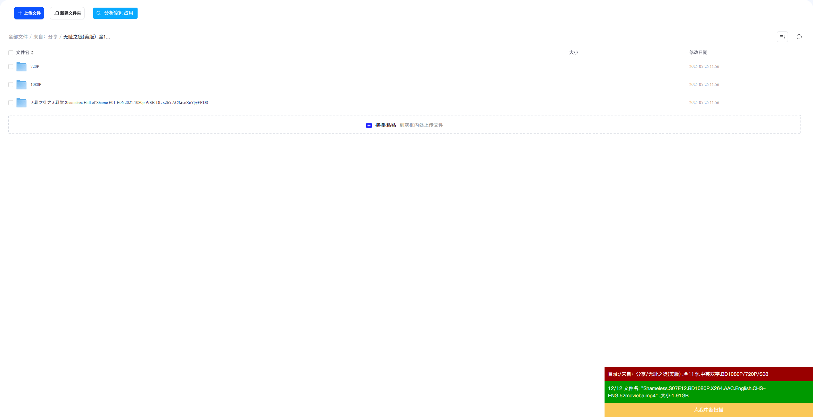
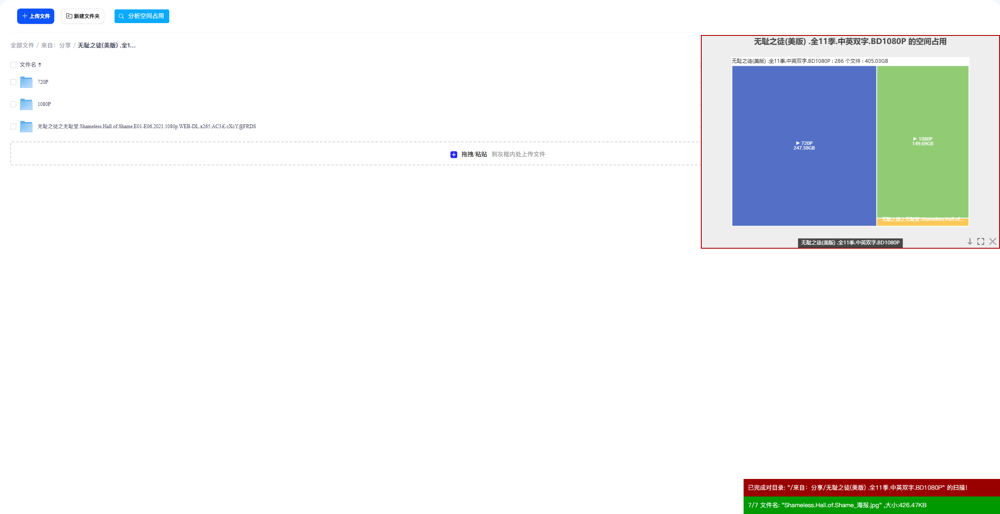
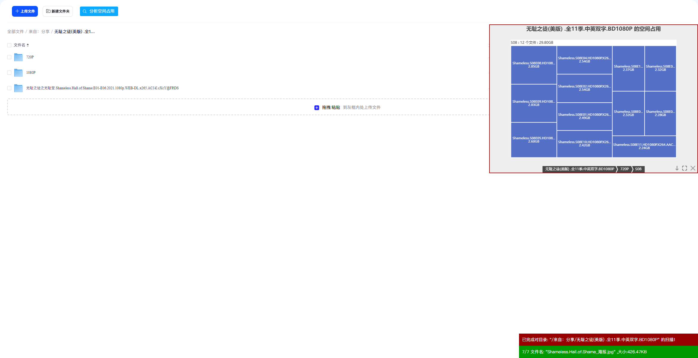

# 夸克网盘空间占用分析

分析夸克网盘当前目录空间占用，并使用 ECharts 矩形树图展示。

## 功能特性

- 使用异步请求，浏览器不卡死
- 实时显示当前扫描的文件夹
- 可随时中断扫描
- 美化图表，丰富信息展示
- 支持从任意目录开始扫描
- 支持分页加载，处理大文件夹
- 可下载文件列表 JSON 数据

## 安装

1. 安装浏览器扩展：[Tampermonkey](https://www.tampermonkey.net/) 或 [Violentmonkey](https://violentmonkey.github.io/)
2. 点击安装脚本：[夸克网盘空间占用分析](https://greasyfork.org/zh-CN/scripts/564638)
3. 访问 [夸克网盘](https://pan.quark.cn/) 即可使用

## 使用方法

1. 打开夸克网盘网页版
2. 进入任意目录（或在根目录）
3. 点击工具栏中的"分析空间占用"按钮
4. 等待扫描完成，查看可视化图表

### 图表操作

- **点击色块**：进入子目录查看详情
- **下载按钮**：导出文件列表 JSON 数据
- **最大化按钮**：全屏显示图表
- **关闭按钮**：关闭图表窗口

## 截图

## 技术说明

- 使用夸克网盘官方 API 获取文件列表
- 递归扫描所有子目录和文件
- 使用 ECharts 矩形树图（Treemap）可视化展示
- 支持大文件夹分页加载（每页 100 条）

## 更新日志

### v1.0 (2026-01-31)

- 初始版本发布
- 支持递归扫描目录
- 实时显示扫描进度
- 可视化图表展示
- 支持从任意目录开始扫描

## 致谢

本脚本思路和部分代码参考自：

- [百度网盘空间占用分析优化版](https://greasyfork.org/zh-CN/scripts/466286) by wiix

## 许可证

本项目采用 [LGPL-3.0](https://www.gnu.org/licenses/lgpl-3.0.html) 许可证。

## 免责声明

本脚本仅供学习交流使用，请勿用于商业用途。使用本脚本产生的任何问题，作者不承担任何责任。

## 问题反馈

如有问题或建议，欢迎在 [Greasy Fork](https://greasyfork.org/zh-CN/scripts/564638/feedback) 反馈。
